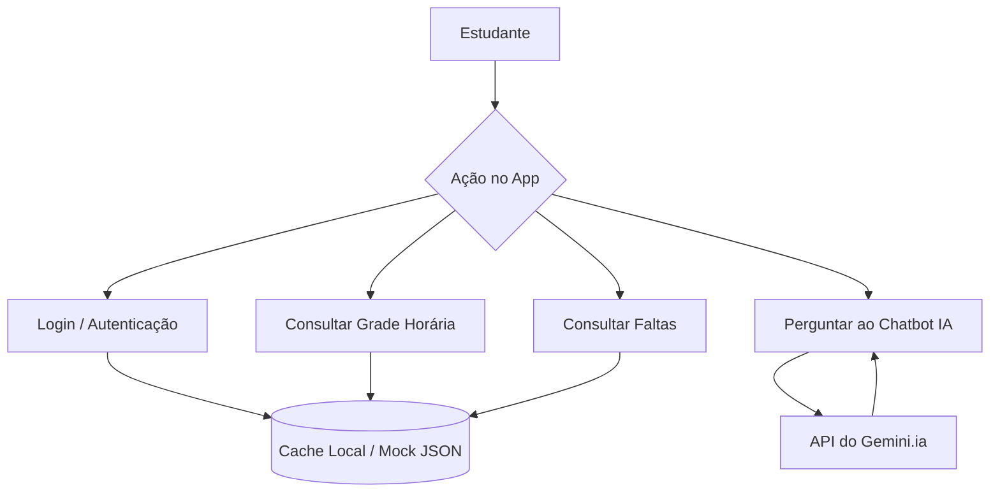
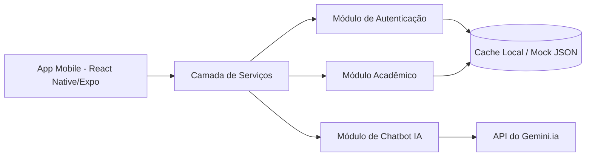
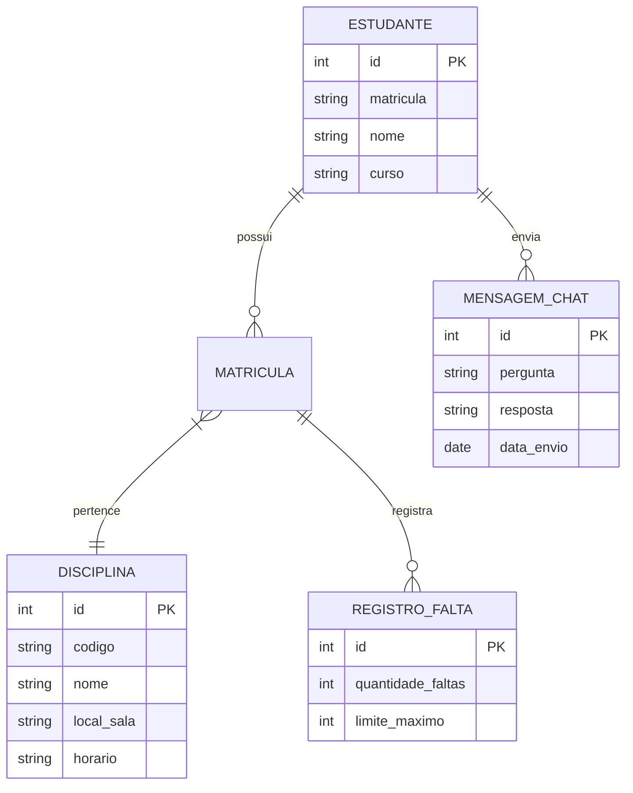

# Relatório de Arquitetura e Modelagem (MVP)

Este documento apresenta a modelagem técnica da solução focada no Produto Mínimo Viável (MVP) do projeto **SIGAA de Bolso**, atendendo às especificações da Etapa 2.

**Descrição do Fluxo do Sistema**
O aplicativo opera sob uma arquitetura híbrida para o MVP: as telas de consulta (grade horária e limite de faltas) consomem um arquivo estático local (Mock JSON) para garantir exibição imediata e simular a experiência mobile, enquanto o módulo de assistente virtual se conecta diretamente à API do Gemini para processamento em nuvem em tempo real.

**Diagrama de Arquitetura (Mermaid.js)**

# Arquitetura da Solução — SIGAA de Bolso

## 1. Fluxo do sistema

## 2. Arquitetura em camadas

## 3. Modelo de dados (entidades principais)

## 4. Justificativa das escolhas

* **App Mobile e Cache Local (Offline-First)**: atende ao RNF01 e RNF02 (acesso instantâneo à grade e locais de aula mesmo sem conexão com a internet).
* **Módulo de Autenticação e Mock Data Store**: cobre RF01, RF02, RNF03 e RNF07 (garante a simulação do fluxo de login e leitura segura dos dados para o MVP).
* **Módulo Acadêmico**: cobre RF03 e RF04 (exibição estruturada da grade semanal, horários, prédios/salas e acompanhamento do limite de faltas).
* **Módulo de Chatbot IA (API Gemini)**: cobre RF08 e RF09 (interface de conversa em linguagem natural para tirar dúvidas acadêmicas).
* **Link para o Trello:** https://trello.com/invite/b/6a8a36de3ae7e7515fed6ab6/ATTI3d6fdeff5870f66e1a879dad36b4a57d581CE463/projeto-sigaa-de-bolso
